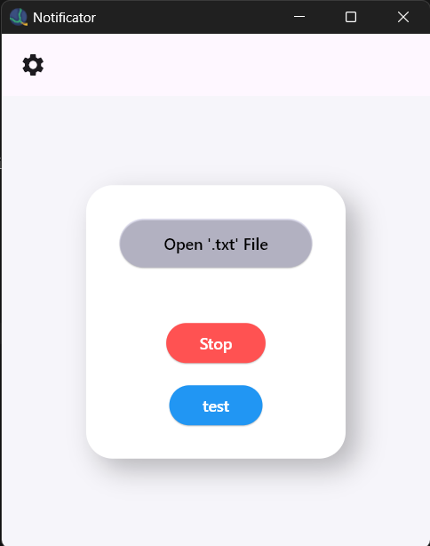
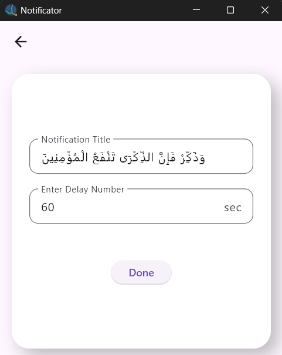
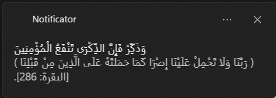

# Notificator

**Notificator** is a cross‑platform Flutter desktop/mobile app (Windows, Linux, macOS, iOS) that shows random notifications from a `.txt` file at user‑defined intervals.  
It runs silently in the system tray and lets you configure the title and delay of notifications.

---

## Features

- **Customizable notifications** – Reads random lines from `Notificator.txt` and shows them as reminders.
- **Settings screen** – Change notification title and delay (seconds).
- **Persistence** – User settings are saved locally with `shared_preferences`.
- **Tray support** – App hides to tray (Windows/Linux) and can be reopened by clicking tray icon.
- **Auto-create file** – If `Notificator.txt` does not exist, it is created automatically.
- **Custom icons** – App and tray icons are provided (`AppIcon.png`/`AppIcon.ico`).

---

## 📦 Packages Used

### UI / Window Management

- cupertino_icons: ^1.0.8
- window_size: ^0.1.0
- window_manager: ^0.5.0
- tray_manager: ^0.5.0

### Notifications

- flutter_local_notifications: ^19.2.1

### Storage / Persistence

- path_provider: ^2.1.5
- shared_preferences: ^2.5.3

---

## Security

- The app only reads/writes to a simple `.txt` file in user space and stores settings via `shared_preferences`.
- No network access, no hidden backdoors.

---

## Screenshots

<pre>
          
</pre>

---

## Build Versions

```yaml
version: 1.1.0
```
